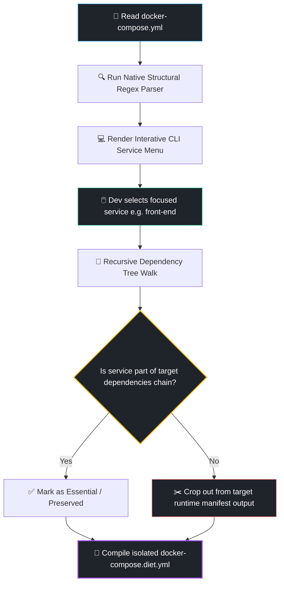

# 🏎️ Compose-Diet


Reclaim up to 70% of your machine's local RAM instantly. **Compose-Diet** is an autonomous, lightweight command-line engine that reads massive multi-container `docker-compose.yml` manifests, computes a dependency graph based on your current task, and crops out non-essential background workloads cleanly.

Stop letting massive databases replicas, analytics microservices, heavy event streaming brokers, and secondary worker queues cripple your local development laptop speed.

---

## ⚡ Quick Start

### 1. Download Tool to Project Root
Pull the optimized, zero-dependency standalone CLI tool straight into the folder containing your giant infrastructure files:

```bash
curl -fsSL https://githubusercontent.com -o compose_diet.py
```

### 2. Run the Shrinker Configuration
Execute the script natively with Python to analyze your current microservices mapping layout:

```bash
python3 compose_diet.py
```

---

## 📐 Dependency Trimming Graph Flow

Compose-Diet parses your topological configuration tree structure dynamically and flags inactive pipelines.



---

## 💎 Superpowers Included

* **Zero-Dependency Architecture:** Written entirely leveraging native core Python libraries. No external heavy PyYAML modules compilation required. It parses layouts cleanly and instantly via file streams arrays.
* **Topological Downstream Isolation:** If you are debugging a small authentication proxy service, it recursively tracks down downstream connections (like Redis/Postgres) keeping them intact, while safely ditching irrelevant parts (like image processors or reporting layers).
* **Non-Destructive Compilation:** Never alters your primary production file structures. It generates an parallel configuration manifest (`docker-compose.diet.yml`) which runs alongside your native stack effortlessly.

---

## 🤝 Contributing

We welcome advanced architectural optimization ideas! Want to add automated memory limitations capping middleware triggers, environment overrides, or Pytest integration suites wrappers?

1. Fork this Repository
2. Implement your features or extensions additions inside `compose_diet.py`
3. Commit optimizations safely (`git commit -m 'Add custom dynamic hardware memory limits injection functionality'`)
4. Push upstream (`git push origin feature/AmazingOptimization`)
5. File a clean Pull Request

## 📝 License

Distributed under the MIT License. See `LICENSE` for more architectural details.
